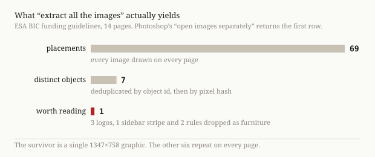
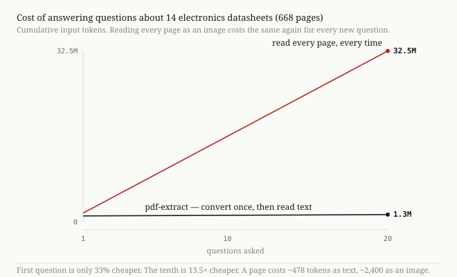

<div align="center">

# pdf-extract

**Read documents properly. Fast local text extraction, plus vision only on what text extraction provably missed.**

[](https://github.com/LPSlv/pdf-extract/actions/workflows/ci.yml)
[](LICENSE)
[](https://skills.sh/)

</div>

Text extraction handles most documents on its own — and silently drops every
chart, pinout diagram, scanned page and merged-header table. Looking at every
page instead catches all of it, and costs 2.4× more.

`pdf-extract` does neither. It extracts text with [pdf-inspector](https://github.com/firecrawl/pdf-inspector)
and [anydoc](https://github.com/firecrawl/anydoc), works out which pages the
extractor actually failed on, and sends only those to your agent's eyes.

Reads **PDF, Word, Excel, PowerPoint and images**. No API key, no per-page bill,
no upload — the vision is the subscription you already pay for.

| across 2,342 PDFs, 20,375 pages | read every page | text only | **pdf-extract** |
|---|--:|--:|--:|
| input tokens | 48.9M | 13.6M | **20.1M** |
| vision calls per page | 1.00 | 0 | **0.34** |
| figures it can see | all | **none** | the ones text missed |

<sub>Text alone is cheapest because it is blind — a floor, not an option. Once
converted, follow-up questions read the cached text and cost 99% less again.</sub>

## Quick start

```bash
npx skills add LPSlv/pdf-extract@pdf-extract
```

Then ask your agent: *"read this datasheet and tell me the Q3 variance."*
Or point it at a folder of mixed `.pdf`, `.docx`, `.xlsx` and `.pptx`.

Requires [`uv`](https://docs.astral.sh/uv/). No API key, no Rust toolchain, no
global installs — dependencies resolve on first run.

### Try it without installing

```bash
git clone https://github.com/LPSlv/pdf-extract && cd pdf-extract
uv run skills/pdf-extract/convert.py example/sample-report.pdf
```

```json
{"status":"ok","artifact":"~/.cache/pdf-inspect/0559ee3a…","cached":false,
 "pending":[{"id":"p001-x5","page":1,"kind":"raster","reason":"standalone_raster",
             "path":"…/images/p001-x5.png"}],
 "dropped":0,"over_scale_guard":false,"scale_guard":15}
```

All the text is already extracted — including the budget table, as real Markdown.
Exactly one item needs eyes. The finished output is committed at
[`example/sample-report.expected.md`](example/sample-report.expected.md), so you
can see what you get before installing anything.

## How it works

```
file ──► classify ──► extract text ─────► route visuals ──► agent looks ──► answer
         by content   pdf-inspector/      the interesting   describe.py    [p12]
         10-50 ms     anydoc              part                             citations
```

### 1. Convert

Everything deterministic happens in one command:

```bash
uv run skills/pdf-extract/convert.py FILE [MORE ...]
```

Prints one JSON object per document. Exit code is non-zero if any document
failed, and a bad file never aborts the batch. Re-running returns
`cached: true` instantly and costs nothing.

### 2. Describe

For each entry in `pending`, read the image file and write back what you saw:

```bash
uv run skills/pdf-extract/describe.py <artifact> <id> "Line chart, two series…"
uv run skills/pdf-extract/describe.py <artifact> <id> -   # long text from stdin
```

Safe to re-run — it replaces rather than duplicates, so a vision pass that dies
halfway just resumes. What to write depends on `reason`:

| `reason` | Write |
|---|---|
| `standalone_raster`, `curves`, `diagonals` | The figure: type, axes and units, notable values, all legible text |
| `no_text_layer` | A **verbatim transcription** — this is the OCR path |
| `dense_grid`, `stroke_grid` | The table, reproduced as Markdown |

### 3. Answer

Read `doc.md` for the whole document, or grep `pages/pNNN.md` and read only the
pages a question touches. Cite as `[p12]`, or `[report.pdf:p12]` across documents.

### Artifact layout

```
~/.cache/pdf-inspect/<sha256>-<engine+schema>/
  source.json     provenance and status
  doc.md          authoritative text, plus delimited descriptions
  pages/p001.md   per-page text, for citation and cheap answering
  images/*.png    extracted rasters and rendered pages
  manifest.json   every kept item, and everything dropped with its reason
```

> [!IMPORTANT]
> Never edit `doc.md` by hand. Everything you add goes through `describe.py`,
> which wraps it in strippable delimiters. That is what lets the benchmark strip
> the additions and prove the skill does not degrade text extraction.

## Extracting the images does not give you the figures

"Extract the images from a PDF" is a well-defined operation that every tool
performs correctly, and it does not do what people expect.



A PDF page is a program of drawing commands. Only *image XObjects* are stored
bitmaps — a chart pasted from Excel is a few hundred rectangle-and-line
operations with no image object to extract. One 14-page grant document yields 69
"images", of which 7 are distinct and 6 are logos and rules. A sibling document
returns **zero** images while containing pages of drawn content.

So both mechanisms are needed, and both need filtering. Every filter exists
because the obvious alternative was tested and failed on a real document:

| Filter | Why it exists |
|---|---|
| Drop images on >50% of pages, <120 px, aspect >8:1 | 69 placements collapse to 1 real graphic |
| Skip pages that already yielded a Markdown table | The extractor beats vision on tables it can parse |
| Require strokes in **both** orientations | Underlines are horizontal only; counting all strokes fired on bibliography pages |
| Stroke-area floor on curves and diagonals | A vendor logo is bézier artwork too — 4N25's only call was its legal disclaimer |
| Drop repeated vector signatures | `ti_ucc27517` carries the same 143-curve logo on six pages |
| Drop emblems repeated across *documents* | The GPO seal fired on 227 of 230 US bills — documents with no figures at all |
| Collapse pages with >6 rasters | A 48-tile inpainting figure is one figure; one TI package photo arrives as 12 strips |
| Never cost more than reading everything | On single-page documents the routed set can lose; the guard caps it |
| Twelve signals tried for branding, one kept | Mastheads and logos are separable from charts only by reading them ([`eval/tds-corpus.md`](eval/tds-corpus.md)) |
| Ink threshold on the dense-grid branch | Separates a shaded table the extractor missed from decorative banners |

Pages render at the resolution their *own smallest text* needs rather than a
flat dpi, measured from the 5th-percentile font on each page. That alone cut
image tokens 54% with identical content capture.

## Reading 20,375 pages costs 2.4× less than looking at them

Twelve corpora, chosen to be unlike each other: electronics datasheets, arXiv and
PMC papers, US legislation, and six olmOCR-bench page classes. Each has a fetch
script and a sha256 manifest, so a result pins to exact inputs.
Full tables: [`docs/benchmarks/RESULTS.md`](docs/benchmarks/RESULTS.md).

<!-- benchmarks:begin -->
Reading every page of these 2,342 PDFs costs 48.9M input tokens. pdf-extract reads the same 20,375 pages for 20.1M — **2.4× less** — because it looks at one page in three (6,834 vision calls over 20,375 pages) instead of all of them.

Extracting text alone is cheaper still, at 13.6M, and captures no figure, scan or unparsed table whatsoever. It is the floor, not an option.

| corpus | files | pages | cheaper by | vision calls per page |
|---|--:|--:|--:|--:|
| `bills` | 230 | 2,736 | **7.0×** | 0.00 |
| `datasheets` | 204 | 7,641 | 2.9× | 0.42 |
| `tds` | 23 | 632 | 2.8× | 0.40 |
| `olmocr_arxiv_math` | 522 | 522 | 2.5× | 0.12 |
| `olmocr_tables` | 188 | 188 | 2.4× | 0.45 |
| `olmocr_headers_footers` | 266 | 266 | 2.1× | 0.50 |
| `arxiv` | 238 | 5,336 | 2.0× | 0.27 |
| `papers` | 24 | 704 | 1.9× | 0.39 |
| `olmocr_scans` | 134 | 134 | 1.8× | 1.00 |
| `olmocr_multi_column` | 231 | 231 | 1.5× | 0.58 |
| `pmc` | 220 | 1,923 | 1.3× | 0.56 |
| `olmocr_long_tiny_text` | 62 | 62 | 0.9× | 1.05 |

`olmocr_long_tiny_text` sits last because it **loses**: 62 single-page documents where text plus one figure render costs more than the page itself. Single pages have nothing to amortise. It stays in the table.
<!-- benchmarks:end -->

## On scans it recovers what text extraction cannot reach

pdf-inspector extracts **zero characters** from these pages. The vision pass recovers most of the content:

| olmOCR-bench `old_scans` | pdf-inspector | pdf-extract |
|---|---|---|
| `present` — is the text there? | 0.0% | **61.5%** |
| `order` — correct reading order? | 0.0% | **59.4%** |
| overall | 18.4% | **60.9%** |

<sub>n=11 documents, 87 tests. The baseline's 18.4% is hollow — it passes <code>absent</code> tests by producing nothing at all.</sub>

### On native-text PDFs it changes nothing, deliberately

Through opendataloader-bench's official evaluator it scores **0.875 overall /
0.915 NID / 0.814 TEDS** — identical to the engine it delegates to, because the
text path is byte-identical and every addition is strippable.

> [!NOTE]
> That 0.875 is pdf-inspector's number, not an improvement. Against the
> benchmark's *full* engine set it ranks 5th of 15 — `opendataloader-hybrid`
> 0.907, `nutrient` 0.885 and `docling` 0.882 all score higher. The equality is
> enforced, not asserted: `eval/gate.py` runs the real pipeline and requires the
> stripped output to equal raw engine output byte for byte.

### Only the first question pays

The artifact is cached, so follow-ups read text instead of pixels.



## Office documents get the contract, not the routing

Word, Excel and PowerPoint go through [anydoc](https://github.com/firecrawl/anydoc)
for text and through the same furniture filters, citation contract, cache and
describe rubric as PDFs. What they do **not** get is the routing intelligence,
and the reason is worth stating plainly rather than glossing.

A PDF page is a program of drawing commands, so a chart is a few hundred
rectangles with nothing to extract — `render_reason()` exists to infer figures
from vector geometry. OOXML declares its images in the package. There is nothing
to infer, and without a rendering engine there is no slide or sheet to render, so
`render_reason`, `raster_grid` and `cost_guard` have no Office analogue.

Three things do carry over, and one is new:

| | |
|---|---|
| Furniture filters | A logo on every slide is dropped by ubiquity exactly as a logo on every page is |
| Citations | `[s07]` for a slide, `[Sheet2]`, `[Budget assumptions]` for a Word heading |
| Byte-identity | Stripped output equals raw anydoc output, enforced by `eval/gate.py` |
| **Spreadsheet charts** | Read from the chart definition, so the numbers are **exact** rather than estimated from pixels — and cost no vision call at all |

That last one exists because anydoc's spreadsheet path is pure cell extraction:
it returns zero assets and no chart for a workbook that demonstrably contains
both. It reads Word and PowerPoint charts perfectly well, so those are left
alone — extracting them twice was the largest error caught during design.

> [!NOTE]
> **No "cheaper by N×" figure is claimed for Office, and none appears in the
> table above.** That column divides by the cost of rendering every page at 140
> dpi. Office has no render, so the denominator would silently mean something
> different in the same table. Office measurements get their own table with
> their own stated baseline, once the corpus exists.

## Not a reimplementation of Firecrawl Parse

Firecrawl's hosted Parse routes on the same open-source `pdf-inspector`
classifier this skill already calls, and bills 1 credit per page whether or not
a page needed OCR. Two differences matter:

- **It routes on text presence alone.** A chart on a page full of text passes
  straight through as text, and the figure is gone. This skill also routes on
  vector geometry, which is what catches those.
- **The vision is yours.** Parse's OCR layer is [GLM-OCR](https://github.com/THUDM), MIT-licensed and
  not Firecrawl's own model, served on their GPUs and billed per page. Here it
  is the agent's own eyes, inside the seat you already pay for.

Selective routing is what makes that practical rather than merely possible: at
1.00 vision calls per page a subscription-funded agent exhausts its budget on
the first document; at the measured 0.34 it does not.

> [!IMPORTANT]
> This is a billing-model comparison, not a quality one. Parse's OCR on a
> scanned page may well read better than a general agent's — that is unmeasured
> here and is not claimed either way.

## Limitations

> [!WARNING]
> - Thresholds are fitted, not learned: ~21 numbers tuned on a handful of real
>   documents, then exercised for regression across 2,342 more. That exercise
>   found two failures the small set could not — see below — so treat the
>   constants as calibrated to the corpora here, not as universal.
> - **Single-page documents can lose.** Nothing amortises; see `olmocr_long_tiny_text`.
> - **Emblems need a batch.** A publisher mark is only distinguishable from a
>   small chart by recurring across documents — twelve signals were measured and
>   eleven rejected ([`eval/tds-corpus.md`](eval/tds-corpus.md)). Convert one
>   government PDF alone and its seal still costs one call.
> - **Branding still costs calls, and zero false positives is not reachable.**
>   Journal mastheads, society logos, conference banners and cover art fire as
>   figures. On a 382-item labelled set ([`tests/raster-labels.tsv`](tests/raster-labels.tsv),
>   every raster firing across four journal corpora, classified by eye) that is
>   **49 cases — 12.8% of raster firings, 3.4% of vision calls, 2.8% of raster
>   tokens**. Twelve signals have been measured and none removes them safely:
>   branding is separable from a figure only by reading what it says, which is
>   the call being avoided. The two best candidates were flawless on the set they
>   were fitted to and then lost real content on the corpora they had not seen —
>   a top-of-page rule dropped a tile of arXiv 2607.29107 Figure 1, and a QR
>   detector dropped robot-manipulation photographs. Cheap handling, not
>   detection, is the mitigation: a branding image costs a median 140 tokens
>   against 878 for a figure, and the describe rubric dismisses one in a line.
> - A table with **no rules and no shading** is invisible to every branch. If the
>   extractor also drops it, the content is lost silently.
> - `stroke_grid` conflates marker-based plots with ruled tables — one label, two causes.
> - Text quality is bounded by pdf-inspector. If it misreads a page, so does this.
> - Figure description *accuracy* is unmeasured in text-bearing PDFs. No public
>   benchmark scores it; `eval/oldscans.md` is the only place it is measured at all.
> - **Office numbers are unmeasured.** There is no pinned Office corpus yet, so
>   no vision-calls-per-unit or filter-cascade figure is published. The
>   correctness guarantees hold — byte-identity is enforced by `eval/gate.py` on
>   every format — but nothing quantitative is claimed.
> - **EMF, WMF and embedded OLE objects cannot be read.** The text engine
>   retains them faithfully and there is no rasterizer here, so they are dropped
>   and counted rather than sent to an agent that cannot open them. Pasted Excel
>   charts and clipart in older decks are frequently EMF, so on legacy documents
>   this content is neither extracted nor viewable. Frequency unmeasured.
> - **Spreadsheet charts can be unreadable.** Scatter and bubble series use a
>   different XML shape than the extractor reads, and a chart referencing an
>   external workbook resolves to nothing. An OOXML chart has no rendered image,
>   so unlike a PDF figure there is no vision fallback — the content is simply
>   unavailable. Counted in `dropped` as `native_chart_unread`.
> - **Word citations need Word headings.** A contract written as numbered prose
>   rather than Heading styles yields one whole-document unit, so `pages/` greps
>   degrade to reading everything.

## Benchmarks

| Document | What it covers |
|---|---|
| [`docs/benchmarks/RESULTS.md`](docs/benchmarks/RESULTS.md) | **All 12 corpora, 2,342 files, 20,375 pages** |
| [`docs/benchmarks/PLAN.md`](docs/benchmarks/PLAN.md) | How each corpus was chosen, sourced and pinned |
| [`eval/tds-corpus.md`](eval/tds-corpus.md) | 23 datasheets — the original three-way comparison |
| [`eval/datasheets.md`](eval/datasheets.md) | Token model and per-stage wall time |
| [`eval/resolution.md`](eval/resolution.md) | Adaptive resolution and the controlled capture test |
| [`eval/oldscans.md`](eval/oldscans.md) | olmOCR-bench scanned-document accuracy |
| [`eval/opendataloader.md`](eval/opendataloader.md) | Regression gate procedure |
| [`tests/raster-labels.tsv`](tests/raster-labels.tsv) | 382 raster firings labelled by eye — content, branding or portrait |

```bash
uv run --with pytest --with firecrawl-anydoc==0.1.6 \
  python -m pytest tests/ -q                      # splice/strip, cache, anydoc invariants
python3 tests/check_sync.py                       # verbatim block matches harvest.py
uv run eval/gate.py example/                      # byte-identity, real pipeline
uv run eval/fetch.py bills && uv run eval/bench.py corpus/bills   # any corpus
uv run eval/report.py                             # regenerate RESULTS.md
python3 eval/readme_tables.py --write             # regenerate this README's tables
```

> [!TIP]
> `harvest.py` is the single source of truth for every routing decision, and
> every number in this README is regenerated from it — none is hand-carried. To
> see routing on your own file without converting anything:
> `uv run skills/pdf-extract/harvest.py FILE.pdf`
