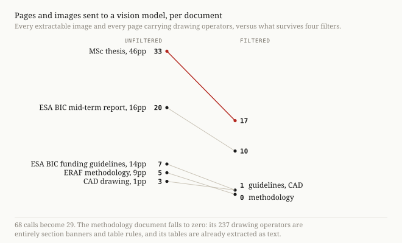
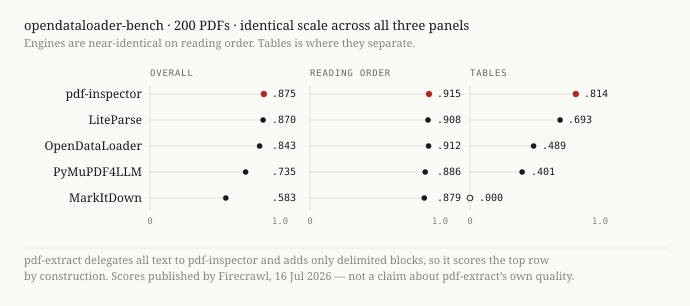

# pdf-extract

An agent skill for reading PDFs properly. Fast local text extraction, plus
vision **only** on what text extraction provably missed — charts, scanned pages,
and tables it failed to structure.

```bash
npx skills add LPSlv/pdf-extract@pdf-extract
```

Then just ask your agent: *"read this PDF and tell me the Q3 variance."*

Requires [`uv`](https://docs.astral.sh/uv/). No API key, no Rust toolchain, no
global installs — dependencies resolve on first run.

## Try it in 30 seconds

A sample report is committed. Run the skill on it:

```bash
uv run skills/pdf-extract/convert.py example/sample-report.pdf
```

```json
{"status":"ok","artifact":"~/.cache/pdf-inspect/0559ee3a…","cached":false,
 "pending":[{"id":"p001-x5","page":1,"kind":"raster",
             "reason":"standalone_raster","path":"…/images/p001-x5.png"}],
 "dropped":0,"over_scale_guard":false}
```

All the text is already extracted — including the budget table, as real
Markdown. Exactly **one** item needs eyes: the chart. Look at it, then:

```bash
uv run skills/pdf-extract/describe.py <artifact> p001-x5 "Line chart, two series…"
```

The finished output is committed at
[`example/sample-report.expected.md`](example/sample-report.expected.md) so you
can see what you get before installing anything.

## The problem it solves

"Extract the images from a PDF" is a well-defined operation that every tool
performs correctly, and it does not do what people expect.


A PDF page is a program of drawing commands. Only *image XObjects* are stored
bitmaps; a chart pasted from Excel is a few hundred rectangle-and-line
operations with no image object to extract. On one 14-page grant document, naive
extraction yields 69 images — 7 distinct objects, six of them logos, rules and a
sidebar stripe. A sibling document returns **zero** images while containing
several pages of drawn content.

So both mechanisms are needed, and both need filtering.

## How it works

1. **Classify** (~10–50 ms) — text-based, scanned, image-based or mixed.
2. **Extract** authoritative Markdown with [pdf-inspector](https://github.com/firecrawl/pdf-inspector).
3. **Harvest** visuals — pull embedded images, drop furniture, detect pages whose
   drawn content the extractor did not capture, render those.
4. **Read** each survivor with your agent's own vision. No separate API.
5. **Answer** from the cached artifact with `[p12]` citations.

Steps 1–3 are deterministic and free. Re-running a PDF is a cache hit.



## Where it actually beats plain extraction

**Scanned documents.** On a 16-PDF sample of olmOCR-bench `old_scans`,
pdf-inspector alone extracts **zero characters** from every file:

| olmOCR-bench test type | pdf-inspector alone | + pdf-extract |
|---|---|---|
| `present` — is the text there? | **0.0%** (0/39) | **61.5%** (24/39) |
| `order` — correct reading order? | **0.0%** (0/32) | **59.4%** (19/32) |
| overall | 18.4% | **57.5%** |

*n=11 documents, 87 tests, transcribed by Claude Opus. The baseline's 18.4% is
hollow — it passes `absent` tests only by producing nothing at all.*

This is the honest headline: on documents with no text layer, plain extraction
scores zero and this recovers most of it, including handwritten cursive that
Tesseract also fails.

## Where it does not

**On native-text PDFs it scores exactly what pdf-inspector scores, by design.**



Running the full pipeline through opendataloader-bench's official evaluator
gives **0.875 overall / 0.915 NID / 0.814 TEDS** — identical to pdf-inspector,
because all text is delegated to it and every addition sits inside strippable
delimiters.

Two things worth stating plainly:

- **That 0.875 is pdf-inspector's number, not an improvement.** Against this
  benchmark's *full* engine set it ranks **5th of 15** — `opendataloader-hybrid`
  0.907, `nutrient` 0.885, `docling` 0.882 all score higher. Firecrawl's
  published comparison omitted those.
- The equality is **enforced, not asserted**: `eval/gate.py` runs the real
  pipeline, describes every item (including a payload that quotes the block
  delimiter, plus a re-describe to simulate a resumed run), strips the additions
  and requires the residue to equal raw engine output byte for byte. 14/14 on
  grant PDFs, scans and charts.

## Cost

On opendataloader-bench: 0.66 vision calls per document, 95 of 200 needing none.
But that corpus is **all single-page**. On real multipage documents it is higher
— 13 calls for a 46-page thesis, 38 for a 31-page hardware manual whose images
are mostly genuine screenshots. `over_scale_guard` fires above 15 so the agent
asks before spending.

## Known limitations

- Thresholds are fitted to a small sample: ~21 numbers tuned on five real
  documents plus ~20 synthetic controls, then exercised for regression across
  200 more. They are not learned, and they will misfire on layouts unlike those.
- A table with no rules and no shading is invisible to every branch. If the
  extractor also drops it, the content is lost silently.
- `stroke_grid` conflates marker-based plots with ruled tables — one label, two
  causes.
- Text quality is bounded by pdf-inspector. If it misreads a page, so does this.
- The furniture filter is size-based, so a full-bleed decorative cover image
  survives it and costs one call.

## Development

```bash
uv run --with pytest python -m pytest tests/ -q   # splice/strip + cache contracts
python3 tests/check_sync.py                       # verbatim block matches harvest.py
uv run eval/gate.py example/                      # byte-identity, real pipeline
uv run skills/pdf-extract/harvest.py FILE.pdf     # routing decisions only
```

`harvest.py` is the single source of truth for routing. Every number in this
README and in `docs/superpowers/specs/` is regenerated from it; none is
hand-carried.

## Licence

MIT.
